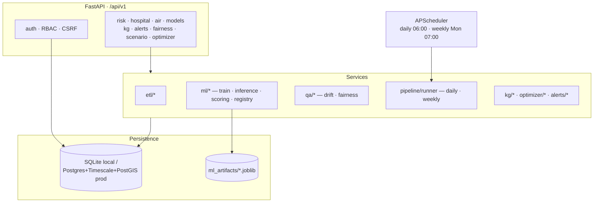
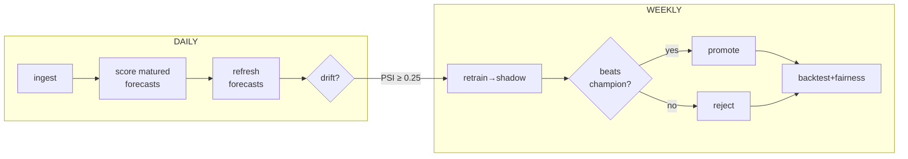

<div align="center">

# 🧠 PRITHVI-AI · Backend

### Climate-health risk forecasting API with a continuous ML loop

<br/>

[](https://fastapi.tiangolo.com/)
[](https://www.python.org/)
[](https://www.sqlalchemy.org/)
[](https://xgboost.readthedocs.io/)
[](#-testing)
[](#-license)

*Part of [PRITHVI-AI](https://github.com/rupeshbharambe24/prithvi-ai) · pairs with the [frontend console](https://github.com/rupeshbharambe24/prithvi-ai-frontend).*

</div>

---

> [!NOTE]
> A FastAPI backend that ingests **real open environmental data**, forecasts four coupled
> health risks per region with uncertainty and SHAP drivers, grounds them in scientific
> evidence, and runs a self-maintaining **train → predict → verify → retrain** loop.
> Boots in seconds on SQLite — **no Docker, Redis, or cloud required.**

## 📑 Contents

- [Highlights](#-highlights) · [What it predicts](#-what-it-predicts) · [Architecture](#-architecture)
- [Data pipelines](#-data-pipelines) · [ML pipeline](#-ml-pipeline) · [Continuous loop](#-continuous-ml-loop)
- [Quick start](#-quick-start) · [API](#-key-api-endpoints) · [Testing](#-testing) · [Project layout](#-project-layout)

## ⭐ Highlights

- 🛰️ **Resilient ingestion** — every external source has a fallback (Open-Meteo→NASA POWER, OpenAQ→AQICN) with full dataset **lineage**.
- 📈 **Explainable forecasts** — XGBoost (sklearn GBR fallback) with **p05/p95** quantile bands and **SHAP top-5 drivers** per prediction.
- 🎯 **Honest accuracy** — skill scored against a **persistence baseline**; live forecast-vs-actual scoring into `backtest_scores`.
- 🏆 **Champion/challenger** — weekly retrain promotes a new model **only if it beats the live one** (≤1 active per target).
- 🛡️ **MLOps built-in** — PSI/KS **drift detection** with auto-retrain triggers, **fairness** gaps per region.
- 📚 **Knowledge graph** — discovers papers (OpenAlex) → NER → entity/evidence graph.
- 🎛️ **Decision tools** — scipy-LP **resource optimizer**, **scenario** engine, rule-based **alerts**.
- 🔐 **Production-grade** — JWT cookies + CSRF, RBAC (5 roles), rate limiting, CSP, audit logging, structlog, OTel, Sentry.

## 🎯 What it predicts

| Target | Output | Primary real signal | Climate fallback |
|--------|--------|---------------------|------------------|
| 🌡️ `heat` | Heat-stress risk `0–1` | heat-index + WBGT | — |
| 🦟 `disease` | Disease (dengue) risk `0–1` | Google Trends `dengue_search` → WHO counts | humidity + precip + heat |
| 🏥 `surge` | Hospital ED surge `0–1` | Trends `heatstroke/hospital_search` | heat + PM2.5 |
| 🌫️ `pm25` | PM2.5 concentration `µg/m³` | OpenAQ station observations | weather-based |

> [!TIP]
> The design **prefers real outcome data and falls back to climate proxies only when absent** —
> and logs which path was taken, citing the surveillance literature (Ginsberg et al. 2009; Yang et al. 2015).

## 🏗️ Architecture



**Two run modes** — *local* (SQLite + in-memory cache/jobs, default, zero infra) and *production*
(Postgres + TimescaleDB + PostGIS, Redis, Celery, MinIO; wired in `infra/docker-compose.yml`).

## 🛰️ Data pipelines

Scheduled daily; each writes raw `observations` + derived `features` (heat-index, wet-bulb, **WBGT**) with lineage (`datasets → dataset_versions → ingest_runs`).

| Flow | Source | Fallback |
|------|--------|----------|
| `open_meteo` / `era5` | Open-Meteo archive + 16-day forecast | NASA POWER |
| `openaq` | OpenAQ v3 (nearest station ≤25 km) | AQICN / WAQI |
| `google_trends` | Search-volume health proxies | — |
| `who_gho` | WHO dengue counts | — |
| `population` | Population vulnerability | — |

## 🤖 ML pipeline

```
features → engineering (lags 1/3/7/14/28, rollings 3/7/14, sin/cos DOY, DOW one-hot)
        → target fn → train/test split (last 30d test)
        → XGBoost (200 trees, depth 4) + optional AutoETS
        → metrics (RMSE/MAE/skill-vs-persistence) + SHAP drivers
        → registry (versioned joblib + model_versions row)
```

## 🔄 Continuous ML loop



Run on demand via the CLI (same code the scheduler runs):

```bash
python -m backend.app.scripts.run_pipeline daily        # ingest + score + forecast + drift
python -m backend.app.scripts.run_pipeline daily --no-ingest
python -m backend.app.scripts.run_pipeline weekly        # retrain + promote + backtest + fairness
python -m backend.app.scripts.run_pipeline score         # score matured forecasts only
python -m backend.app.scripts.run_pipeline forecast      # refresh forward forecasts only
```

## 🚀 Quick start

```bash
python -m venv .venv
.venv\Scripts\activate          # Windows  ·  source .venv/bin/activate on macOS/Linux
pip install -e .
uvicorn backend.app.main:app --host 0.0.0.0 --port 8000 --reload
```

- SQLite DB auto-created at `./prithvi.db`, demo users seeded on startup.
- OpenAPI docs: **`http://localhost:8000/docs`**

**Demo users**

| Email | Password | Role |
|-------|----------|------|
| `admin@example.com` | `Admin123!` | OrgAdmin |
| `viewer@example.com` | `Viewer123!` | Viewer |

## 🔌 Key API endpoints

```http
POST /api/v1/auth/login
GET  /api/v1/risk/heat?regionId=1&horizon=7d
GET  /api/v1/hospital/surge?regionId=1&horizon=7d
GET  /api/v1/air/pm25?regionId=1&horizon=72h
GET  /api/v1/models/registry?target=heat
GET  /api/v1/models/all
GET  /api/v1/kg/search?q=heat
GET  /api/v1/fairness/heat   ·   GET /api/v1/data/series?...
```

## 🧪 Testing

```bash
pytest backend/tests -v
```
Continuous-pipeline test suite (status column, champion/challenger, scoring idempotency, runner, CLI):
```bash
pytest backend/tests/test_pipeline_runner.py backend/tests/test_registry_promotion.py \
       backend/tests/test_forecast_scoring.py backend/tests/test_run_pipeline_cli.py -v
```

## 📁 Project layout

```
backend/app/
├── api/v1/        REST routes (risk, hospital, air, models, kg, alerts, fairness, …)
├── services/
│   ├── etl/       data ingestion flows (+ fallbacks)
│   ├── ml/        train · inference · scoring · registry · features · explain
│   ├── qa/        drift (PSI/KS) · fairness
│   ├── pipeline/  runner — daily & weekly orchestration
│   ├── kg/        paper discovery · NER · graph builder
│   ├── optimizer/ scipy LP resource allocation
│   └── alerts/    rule engine + delivery
├── db/            models · migrations · session · local bootstrap
├── scripts/       run_pipeline (CLI) · seed_dev
└── workers/       Celery tasks (prod)
docs/superpowers/  design spec + implementation plan for the continuous loop
```

## 📜 License

MIT.
